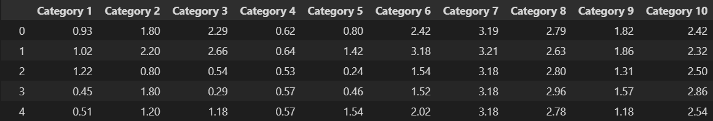

<!DOCTYPE html>
<html lang="en">
<head>
    <meta charset="UTF-8">
    <meta name="viewport" content="width=device-width, initial-scale=1.0">
</head>
<body>
    <h1>Comparative Performance Study of Clustering Algorithms with Various Preprocessing Techniques</h1>
    
This project performs a comparative study of clustering algorithms by analyzing their performance with different preprocessing techniques, various numbers of clusters, and evaluation parameters using Pycaret Library.

    <h2>Dataset</h2>
    
The dataset used in this study is sourced from the UCI Machine Learning Repository. Below is a screenshot of the dataset:

    
    <h2>Project Overview</h2>
    <ul>
        <li><strong>Dataset:</strong> A small dataset from the UCI library.</li>
        <li><strong>Algorithms:</strong> Clustering techniques such as K-Means, Hierarchical Clustering and K-Mean Shift Clustering.</li>
        <li><strong>Preprocessing Techniques:</strong>
            <ul>
                <li>No Data Processing</li>
                <li>Normalization</li>
                <li>Transformation</li>
                <li>PCA (Principal Component Analysis)</li>
                <li>Combinations like Transformation + Normalization (T+N) and T+N + PCA</li>
            </ul>
        </li>
    </ul>
    <h2>Results Summary</h2>
    <h3> For K-Means Clustering</h3>
    <table>
        <tr>
            <th rowspan="2">Parameters</th>
            <th colspan="3">No Data Processing</th>
            <th colspan="3">Using Normalization</th>
            <th colspan="3">Using Transform</th>
            <th colspan="3">Using PCA</th>
            <th colspan="3">Using T+N</th>
            <th colspan="3">T+N+PCA</th>
        </tr>
        <tr>
            <th>c=3</th>
            <th>c=4</th>
            <th>c=5</th>
            <th>c=3</th>
            <th>c=4</th>
            <th>c=5</th>
            <th>c=3</th>
            <th>c=4</th>
            <th>c=5</th>
            <th>c=3</th>
            <th>c=4</th>
            <th>c=5</th>
            <th>c=3</th>
            <th>c=4</th>
            <th>c=5</th>
            <th>c=3</th>
            <th>c=4</th>
            <th>c=5</th>
        </tr>
        <tr>
            <td>Silhouette</td>
            <td>0.1479</td>
            <td>0.1394</td>
            <td>0.1364</td>
            <td>0.1479</td>
            <td>0.1394</td>
            <td>0.1364</td>
            <td>0.1479</td>
            <td>0.1394</td>
            <td>0.1364</td>
            <td>0.1479</td>
            <td>0.1394</td>
            <td>0.1364</td>
            <td>0.1481</td>
            <td>0.1310</td>
            <td>0.1315</td>
            <td>0.1479</td>
            <td>0.1318</td>
            <td>0.1251</td>
        </tr>
        <tr>
            <td>Calinski-Harabasz</td>
            <td>203.30</td>
            <td>169.29</td>
            <td>143.78</td>
            <td>203.30</td>
            <td>169.29</td>
            <td>143.78</td>
            <td>203.30</td>
            <td>169.29</td>
            <td>143.78</td>
            <td>203.30</td>
            <td>169.29</td>
            <td>143.78</td>
            <td>203.30</td>
            <td>160.63</td>
            <td>145.78</td>
            <td>203.30</td>
            <td>160.16</td>
            <td>147.24</td>
        </tr>
        <tr>
            <td>Davies-Bouldin</td>
            <td>2.14</td>
            <td>1.99</td>
            <td>2.00</td>
            <td>2.14</td>
            <td>1.99</td>
            <td>2.00</td>
            <td>2.14</td>
            <td>1.99</td>
            <td>2.00</td>
            <td>2.14</td>
            <td>1.99</td>
            <td>2.00</td>
            <td>2.14</td>
            <td>2.16</td>
            <td>2.04</td>
            <td>2.14</td>
            <td>2.06</td>
            <td>2.06</td>
        </tr>
    </table>
     <h3> For Hierarchical Clustering</h3>
    <table>
        <tr>
            <th rowspan="2">Parameters</th>
            <th colspan="3">No Data Processing</th>
            <th colspan="3">Using Normalization</th>
            <th colspan="3">Using Transform</th>
            <th colspan="3">Using PCA</th>
            <th colspan="3">Using T+N</th>
            <th colspan="3">T+N+PCA</th>
        </tr>
        <tr>
            <th>c=3</th>
            <th>c=4</th>
            <th>c=5</th>
            <th>c=3</th>
            <th>c=4</th>
            <th>c=5</th>
            <th>c=3</th>
            <th>c=4</th>
            <th>c=5</th>
            <th>c=3</th>
            <th>c=4</th>
            <th>c=5</th>
            <th>c=3</th>
            <th>c=4</th>
            <th>c=5</th>
            <th>c=3</th>
            <th>c=4</th>
            <th>c=5</th>
        </tr>
        <tr>
            <td>Silhouette</td>
            <td>0.2187</td>
            <td>0.1338</td>
            <td>0.1268</td>
            <td>0.1847</td>
            <td>0.1033</td>
            <td>0.0957</td>
            <td>0.2239</td>
            <td>0.1925</td>
            <td>0.1777</td>
            <td>0.1847</td>
            <td>0.1033</td>
            <td>0.0957</td>
            <td>0.1217</td>
            <td>0.1239</td>
            <td>0.0847</td>
            <td>0.1847</td>
            <td>0.1033</td>
            <td>0.0957</td>
        </tr>
        <tr>
            <td>Calinski-Harabasz</td>
            <td>263.44</td>
            <td>219.18</td>
            <td>197.59</td>
            <td>156.19</td>
            <td>131.33</td>
            <td>118.75</td>
            <td>376.92</td>
            <td>320.89</td>
            <td>299.36</td>
            <td>156.19</td>
            <td>131.33</td>
            <td>118.75</td>
            <td>168.64</td>
            <td>133.87</td>
            <td>115.99</td>
            <td>156.19</td>
            <td>131.33</td>
            <td>118.75</td>
        </tr>
        <tr>
            <td>Davies-Bouldin</td>
            <td>1.77</td>
            <td>2.00</td>
            <td>1.92</td>
            <td>1.58</td>
            <td>2.26</td>
            <td>2.23</td>
            <td>1.35</td>
            <td>1.48</td>
            <td>1.60</td>
            <td>1.58</td>
            <td>2.26</td>
            <td>2.23</td>
            <td>2.38</td>
            <td>2.21</td>
            <td>2.33</td>
            <td>1.58</td>
            <td>2.26</td>
            <td>2.23</td>
        </tr>
    </table>
     <h3> For K-Mean Shift Clustering</h3>
    <table>
        <tr>
            <th rowspan="2">Parameters</th>
            <th colspan="3">No Data Processing</th>
            <th colspan="3">Using Normalization</th>
            <th colspan="3">Using Transform</th>
            <th colspan="3">Using PCA</th>
            <th colspan="3">Using T+N</th>
            <th colspan="3">T+N+PCA</th>
        </tr>
        <tr>
            <th>c=3</th>
            <th>c=4</th>
            <th>c=5</th>
            <th>c=3</th>
            <th>c=4</th>
            <th>c=5</th>
            <th>c=3</th>
            <th>c=4</th>
            <th>c=5</th>
            <th>c=3</th>
            <th>c=4</th>
            <th>c=5</th>
            <th>c=3</th>
            <th>c=4</th>
            <th>c=5</th>
            <th>c=3</th>
            <th>c=4</th>
            <th>c=5</th>
        </tr>
        <tr>
            <td>Silhouette</td>
            <td>0.1940</td>
            <td>0.1940</td>
            <td>0.1940</td>
            <td>0.2710</td>
            <td>0.2710</td>
            <td>0.2710</td>
            <td>0</td>
            <td>0</td>
            <td>0</td>
            <td>0.1940</td>
            <td>0.1940</td>
            <td>0.1940</td>
            <td>0.2836</td>
            <td>0.2836</td>
            <td>0.2836</td>
            <td>0.2836</td>
            <td>0.2836</td>
            <td>0.2836</td>
        </tr>
        <tr>
            <td>Calinski-Harabasz</td>
            <td>38.72</td>
            <td>38.72</td>
            <td>38.72</td>
            <td>24.21</td>
            <td>24.21</td>
            <td>24.21</td>
            <td>0</td>
            <td>0</td>
            <td>0</td>
            <td>38.72</td>
            <td>38.72</td>
            <td>38.72</td>
            <td>13.46</td>
            <td>13.46</td>
            <td>13.46</td>
            <td>13.46</td>
            <td>13.46</td>
            <td>13.46</td>
        </tr>
        <tr>
            <td>Davies-Bouldin</td>
            <td>1.1312</td>
            <td>1.1312</td>
            <td>1.1312</td>
            <td>1.11</td>
            <td>1.11</td>
            <td>1.11</td>
            <td>0</td>
            <td>0</td>
            <td>0</td>
            <td>1.1312</td>
            <td>1.1312</td>
            <td>1.1312</td>
            <td>1.008</td>
           <td>1.008</td>
           <td>1.008</td>
            <td>1.008</td>
           <td>1.008</td>
           <td>1.008</td>
        </tr>
    </table>
    <h2>Conclusion</h2>
    
The study highlights the impact of preprocessing techniques on the performance of clustering algorithms. For example:

    <ul>
        <li>PCA often improves clustering quality by reducing dimensionality.</li>
        <li>Normalization is crucial for distance-based clustering methods like K-Means.</li>
        <li>Combined techniques (T+N+PCA) might offer better results depending on the dataset.</li>
    </ul>
    <h2>Author</h2>
    
Krishnansh Verma

</body>
</html>
